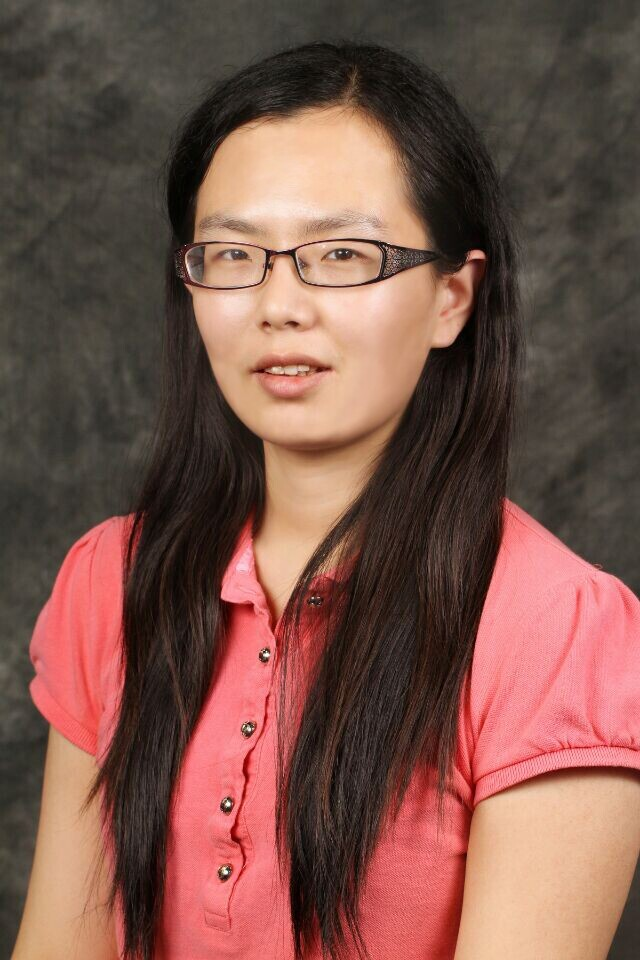

# Yawei Wang


&nbsp;

Welcome! I'm Yawei Wang, a 4th PhD candidate at [The George Washington University](http://www.gwu.edu/) working with [Xiuzhen Cheng](https://www.seas.gwu.edu/xiuzhen-susan-cheng). Before that, I received my B.S. from [Purdue University](https://www.purdue.edu/) in 2015.

### Research Interests

* Artificial Intelligence
* Internet of Things Security 
* Security and Privacy in Social Networks 

&nbsp;

## Publications

  * **A Reinforcement Learning Approach for Branch Overload Relief in Power Systems**, Under Review, Mariana Kamel, *__Yawei Wang__, Chen Yuan, Fangxing Li, Guangyi Liu, Renchang Dai, Xiuzhen Cheng*. Energy Society General Meeting, 2020.
  * **A Correlated Equilibrium based Transaction Pricing Mechanism in Blockchain**, Under Review, Mariana Kamel, *Qin Hu, Yash Nigam, Zhilin Wang, __Yawei Wang__, Yinhao Xiao*. IEEE International Conference on Blockchain and Cryptocurrency, 2020.
  * **Wide and Recurrent Neural Networks for Detection of False Data Injection in Smart Grids**, *__Yawei Wang__, Donghui Chen, Cheng Zhang, Xi Chen, Baogui Huang, Xiuzhen Cheng*. International Conference on Wireless Algorithms, Systems, and Applications, 2019.
  * **Contingency Screening Using Wide and Deep Convolutional Neural Network**, Mariana Kamel, *__Yawei Wang__, Mariana Kamel, Chen Yuan, Fangxing Li, Guangyi Liu, Renchang Dai, Xiuzhen Cheng*. International Conference on Identification, Information &  Knowledge in the Internet of Things, 2019.
   * **Online Social Networks De-anonymization Based on User Interactions**, *Cheng Zhang, __Yawei Wang__*. Knowledge in the Internet of Things, 2019. （Best Paper Award）
    * **International Conference on Wireless Algorithms, Systems, and Applications**, Mariana Kamel, *Cheng Zhang, Honglu Jiang, __Yawei Wang__, Qin Hu, Jiguo Yu, Xiuzhen Cheng*. International Conference on Wireless Algorithms, Systems, and Applications, 2019.
     * **Attribute-Enhanced De-anonymization of Online Social Networks**, Mariana Kamel, *Cheng Zhang, Shang Wu, Honglu Jiang, __Yawei Wang__, Jiguo Yu, Xiuzhen Cheng*. The International Conference on Computational Data and Social Networks, 2019.
      * **Constructing a Self-stabilizing CDS with Bounded Diameter in Wireless Networks under SINR**, Mariana Kamel, *Jiguo Yu, Xueli Ning, Yunchuan Sun, Shengling Wang, __Yawei Wang__*. IEEE International Conference on Computer Communications, 2017.
 

## Research Experience
  * **Research Intern, Microsoft Research**, Jun 2018 - Sept 2018
	* Project: A Real-Time Pipeline for a Large-Scale Machine Learning System
	* Mentor: Dany Fabian

  * **Research Intern, Hewlett Packard Labs**, Jun 2016 - May 2017
	* Project: A Scalable and Predicable NFV Platform for Rack-Scale Architecture
	* Mentor: Jean Tourrilhes

  * **Network Systems Research Intern, BBN Technologies**, Summer 2015
    * Project: Real Time Network and Application Performance Monitoring Framework
    * Mentor: Niky Riga

  * **Research Intern, Chinese Academy of Sciences**, Sept 2011 - May 2012
    * Project: Optimizing Network Performance of Virtual Machine Live Migration
    * Mentors: Yuzhong Sun and Ying Song

  * **Summer Intern, Queen Mary, University of London**, Summer 2011
    * Project: Elastic Message-oriented Middleware System on Top of Cloud Platform
    * Mentors: Yasir Alfadhl and John Bigham

## Teaching Experience
  * **Guest Lecturer, George Washington University**
    * Introduction to Network Function Virtualization (NFV), Fall 2018
    * Global Environment for Network Innovations (GENI) Tutorial, Fall 2015
  * **Teaching Assistant, George Washington University**
    * CSCI 2113 Software Engineering, Fall 2013 - Spring 2015
  * **Teaching Assistant, Stony Brook University**
    * ESE 124 Computer Techniques for Electronic Design I, Spring 2013
    * ESE 123 Introduction to Electrical and Computer Engineering, Fall 2012

## Awards and Honors
  * [HP Helion OpenStack Scholarship](http://community.hpe.com/t5/Grounded-in-the-Cloud/HP-Announces-Winners-of-Women-of-OpenStack-Scholarship-Program/ba-p/6680603#.VoW1hxqANBd), Dec 2014
  * [First Place in 22nd GENI Engineering Conference Competition](http://it.gwu.edu/winners-gec22-student-competition-announced), Mar 2015
  * [GWU 2015 SEAS R&D Showcase Finalists](http://gwtoday.gwu.edu/2015-seas-research-and-development-showcase-spurs-innovation), Feb 2015
  * IEEE RTAS Best Student Paper Award and Outstanding Paper, Apr 2018
  * GWU Women Scholarship for attending Grace Hopper, Oct 2014, Oct 2018
  * ACM SIGCOMM Travel Grant, Aug 2014, Aug 2016
  * CRA-W Grad Cohort Travel Grant, Apr 2015, Apr 2016
  * ACM Travel Grant for attending Diversity’15 and SOSP’15, Oct 2015
  * USENIX NSDI Travel Grant for attending NSDI'15, May 2015
  * NSF Student Scholarship for GENI Summer Camp'14, July 2014
  * First Class Academic Scholarship of BUPT, Sept 2009, Sept 2011
  * Outstanding Student Cadre of BUPT, Sept 2011
  * Winner of Summer Research Project in London, July 2011
